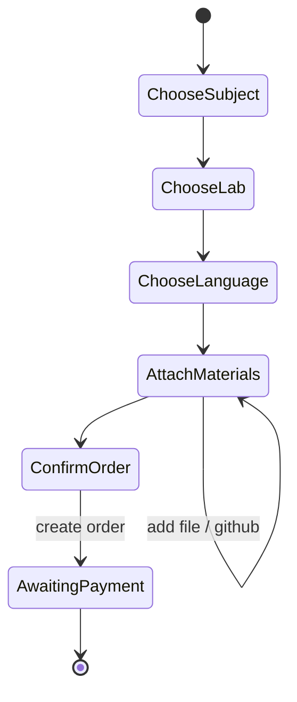
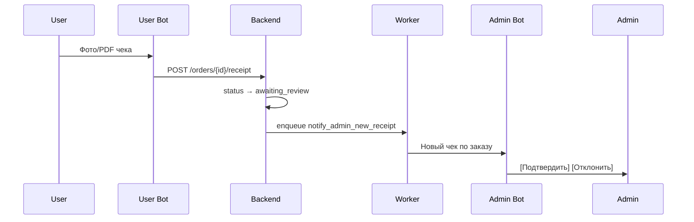
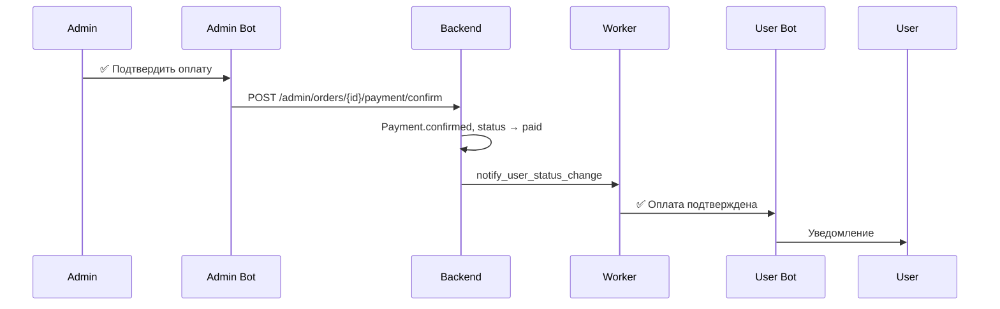

# Бизнес-процессы

## 1. Создание заказа (User Bot)

### Шаги

1. **Предмет** — ADS / PP1 / PP2 (кнопки)
2. **Лабораторная** — только активные из каталога
3. **Язык** — только если у лабы несколько языков; иначе пропуск
4. **Материалы** (можно несколько):
   - файл кода (.py, .cpp, .java, …)
   - конспект (PDF, DOCX, TXT)
   - изображение
   - GitHub URL (repo или file)
5. **Подтверждение** — показ цены, кнопка «Создать заказ»
6. API: `POST /orders` → статус `awaiting_payment`
7. Бот показывает **инструкцию оплаты** (из конфига `PAYMENT_INSTRUCTIONS`)

## 2. Оплата и чек

### Правила

- Чек: JPG, PNG, PDF
- Макс. размер — `MAX_RECEIPT_SIZE_MB`
- Без чека статус остаётся `awaiting_payment`
- После загрузки чека — `awaiting_review`

## 3. Подтверждение оплаты (Admin)

**Отклонение:**

- `POST /admin/orders/{id}/payment/reject`
- Статус → `rejected` или обратно `awaiting_payment` (настраивается)
- Пользователь получает ❌ с комментарием admin

## 4. Жизненный цикл после оплаты

| Действие admin | Новый статус | Уведомление user |
|----------------|--------------|------------------|
| Принять в работу | `in_progress` | 🟡 Заказ принят / 🔵 В работе |
| Завершить | `completed` | ✅ Заказ завершён |
| Отклонить | `rejected` | ❌ Заказ отклонён |

Каждая смена статуса пишется в `order_status_history`.

## 5. Просмотр заказа (User)

- Команда `/orders` или кнопка «Мои заказы»
- `GET /users/{telegram_id}/orders`
- Карточка: #id, предмет, лаба, статус, дата

## 6. Admin: список и фильтры

- `/orders` — последние N заказов
- `/orders awaiting_review` — фильтр по статусу
- Карточка заказа: файлы, GitHub, чек, контакт @username

## 7. Фоновые процессы (Worker)

| Процесс | Расписание | Описание |
|---------|------------|----------|
| `cleanup_temp_files` | каждые 6 ч | Удалить temp старше TTL |
| `retry_failed_notifications` | каждые 15 мин | Повтор неудачных уведомлений |

## 8. Обработка ошибок

- API возвращает `{ "detail": "..." }` с HTTP-кодом
- Bot показывает user-friendly текст, логирует `request_id`
- Секреты и содержимое файлов **не** логируются

## 9. Rate limiting (план)

| Действие | Лимит |
|----------|-------|
| Создание заказа | 5 / час / user |
| Загрузка файла | 20 / час / user |
| Admin API | без лимита (по ADMIN_ID) |

Реализация — Redis + middleware в API и bot throttling.

## Проверка чека (адаптировано из poparim)

1. Mini App показывает реквизиты (`GET /miniapp/settings`) с кнопкой «Копировать» и открывает `t.me/<bot>?start=r<id>`.
2. User Bot принимает фото/PDF и без deep-link: заказ определяется по `#N` в подписи/ответе или берётся последний неоплаченный. `POST /bot/receipt` переводит заказ в `awaiting_review`; повторный чек отклоняется.
3. Воркер `notify_admin_receipt` скачивает файл пользовательским ботом и отправляет админ-боту одним сообщением: чек + карточка заказа + кнопки. id сообщения сохраняется в `payments`. При ошибке заказ откатывается в `awaiting_payment`, пользователя просят прислать чек заново.
4. Кнопки: ✅/❌ по оплате, после подтверждения — «🔑 Доступы» (пароль под спойлером) и «✅ Готово». Каждое действие редактирует ту же карточку; повторное нажатие ничего не меняет.
5. После ❌ заказ снова ждёт чек, пользователь получает «🔴 Оплата не подтверждена».
